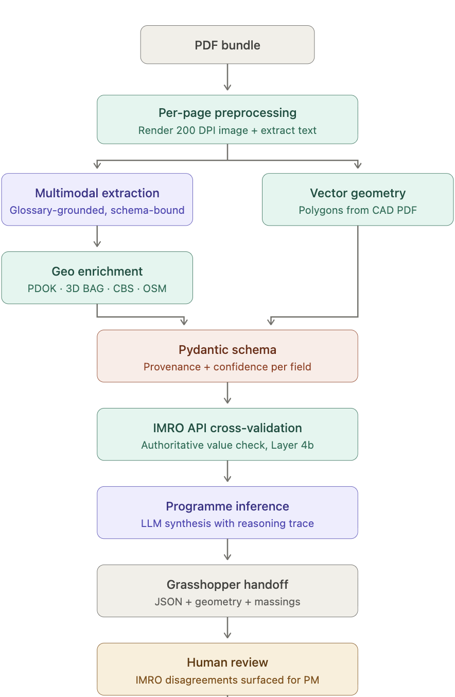

# OMRT doc-extractor

A prototype that turns Dutch project document bundles (bestemmingsplan regels, toelichting, kaveltekening) into a validated, structured Parametric Framework ready for Grasshopper.

## What it does

The pipeline reads a folder of project PDFs, runs multimodal LLM extraction (Claude Sonnet) to pull constraints with provenance and confidence on every value, parses vector geometry from the kaveltekening, enriches with geo context from Dutch open APIs (PDOK, 3D BAG, CBS, OSM), cross-validates critical numbers against the authoritative IMRO API (if possible), infers a programme proposal (Claude Opus), and writes JSON artifacts the Grasshopper engineer consumes directly.

Every extracted value carries a `Provenance` (document, page, verbatim quoted text) and a `Confidence` score. The output is never authoritative until a human marks it `reviewed` in the Streamlit viewer.



For architecture and design rationale see [docs/architecture.md](docs/architecture.md).
For the field-by-field schema specification see [docs/schema_reference.md](docs/schema_reference.md).

---

## Quick start

### Prerequisites

- Python 3.11+
- [uv](https://github.com/astral-sh/uv) package manager
- An Anthropic API key (required)
- Optionally: DSO / Stelselcatalogus API keys for IMRO cross-validation and glossary seeding

### Install and configure

```bash
# 1. Install dependencies
uv sync --extra dev

# 2. Configure environment
cp .env.example .env
# Edit .env — minimum required: ANTHROPIC_API_KEY
```

The `.env.example` documents every key:

| Variable | Required | Purpose |
|---|---|---|
| `ANTHROPIC_API_KEY` | Yes | LLM extraction and programme inference |
| `STELSELCATALOGUS_API_KEY` / `DSO_GENERAL_API_KEY` | No | Glossary seeding from national catalog |
| `DSO_RP_API_KEY` | No | IMRO Ruimtelijke Plannen cross-validation |

### First run

```bash
# 3. Seed the glossary (one-off, optional but recommended)
python scripts/seed_glossary.py

# 4. Run the pipeline on the example project
omrt run data/inputs/draka/

# 5. Review outputs in the Streamlit viewer
streamlit run viewer/streamlit_app.py
```

Estimated time for a full run: **60–90 minutes** (depending on document length).
Estimated API cost: **€1.50–3.00**.

---

## Running on a new project

1. Place the project's PDFs in `data/inputs/<project_name>/` — include the regels, toelichting, and kaveltekening.
2. Make sure `ANTHROPIC_API_KEY` is set.
3. Run:

```bash
omrt run data/inputs/<project_name>/
```

4. Outputs land in `data/outputs/<project_name>/`.
5. Run the sanity check to confirm outputs are well-formed:

```bash
python scripts/sanity_check.py data/outputs/<project_name>/
```

6. Open the Streamlit viewer to inspect and mark the project reviewed:

```bash
streamlit run viewer/streamlit_app.py
```

---

## Pipeline flags

`omrt run <input_dir>` derives the project name from the input directory basename.

The four expensive stages (extraction, geo enrichment, IMRO cross-validation, programme inference) are **skipped when cached output already exists**. The cheap chain (geometry parse, reconciliation, framework assembly, massings, handoff) always re-runs.

| Flag | Effect |
|---|---|
| `--force` | Re-run every stage, ignore caches |
| `--skip-extraction` | Skip LLM extraction (cached output must exist) |
| `--skip-programme` | Skip programme inference |
| `--skip-enrich` | Skip geo enrichment |
| `--skip-cross-validate` | Skip IMRO API cross-validation |

---

## Output files

Every project writes to `data/outputs/<project_name>/`:

| File | Stage | Description |
|---|---|---|
| `extraction_raw.json` | Expensive (LLM) | Raw per-page extraction partials before merge |
| `programme.json` | Expensive (LLM) | Programme proposal: unit mix, GFA split, parking demand, reasoning trace |
| `geo_context.json` | Expensive (APIs) | Geo enrichment from PDOK BAG, 3D BAG, CBS, OSM |
| `imro_cross_validation.json` | Expensive (API) | IMRO comparison results per constraint |
| `geometry.json` | Cheap | Flat geometry-only view of parsed kaveltekening |
| `reconciliation_report.json` | Cheap | Matched, corrected, and unmatched polygon report |
| `framework.json` | Cheap | **Primary handoff** — full `ParametricFramework` with all constraints, zones, geometry refs, programme, provenance |
| `summary.md` | Cheap | Human-readable summary with section headers |
| `massing_inputs.json` | Cheap | Slim numeric envelope (heights, footprints, setback triggers) for Grasshopper |
| `geometry/*.compas` | Cheap | Per-polygon COMPAS Polygon JSON, one file per zone |
| `massings/*.compas.json` + `*.obj` | Cheap | Example massings for variant A (maximum envelope) and variant B (setback-compliant) |

---

## Grasshopper handoff

The `grasshopper/` folder is where computational designers work. It holds reference example outputs and format documentation. The live artifacts for each project are in `data/outputs/<project_name>/`; the grasshopper folder holds a **snapshot copy** for handoff.

### Two parallel approaches

The pipeline produces two approaches depending on what source data is available.

**Approach 1 — PDF only (general purpose)**

Runs on any Dutch zoning packet. The primary input is `framework.json`.

**Approach 2 — GML-authoritative (project-specific)**

Only produced when a bestemmingsplan GML is available (currently Draka only). Provides georeferenced geometry in RD New / WGS84, suitable for the Heron GH plugin.

### Approach 1 — file-by-file guide for the computational designer

**`framework.json`** — the canonical handoff. Contains the full `ParametricFramework` Pydantic model. Read [docs/schema_reference.md](docs/schema_reference.md) for every field. Key sections:

- `site` — project metadata, plan ID, verification status
- `constraints.numerical` — all numeric constraints (heights, setbacks, footprint ratios, parking norms, BVO caps) each with provenance, confidence, and IMRO cross-validation result
- `constraints.qualitative` — use requirements, sustainability conditions, noise rules
- `zones` — per-zone bestemmingen, aanduidingen, and geometry references
- `programme` — inferred unit mix, GFA split, parking demand, evidence-cited reasoning
- `geo_context` — BAG buildings, CBS demographics, OSM amenities within project area

Before driving any geometry, check `verification_status`. If it is `extracted` (not `reviewed`), surface low-confidence fields (score below the `review_threshold`, typically 0.85) to the reviewer.

**`massing_inputs.json`** — a slim subset of `framework.json` filtered to envelope-driving constraint categories only (height, footprint, setback, FSI/FAR, BVO caps, use mix). Use this when you don't need the full audit trail. Contains the same provenance and confidence fields, just fewer constraints.

**`geometry/<zone_id>.compas`** — one file per zone polygon. COMPAS-JSON `Polygon` objects with 3D points (z=0). Coordinate space is PDF units; convert to metres using `meters_per_unit = 0.35277` and `scale_denominator` from `framework.json`. Polygon types: `bouwvlak_*` (buildable envelopes), `plot_boundary` (site boundary), `no_build_zone_*` (exclusion areas), `dvg_*` (dubbelbestemming overlays).

**`geometry.json`** — flat geometry-only view. Use for quick spatial inspection without parsing the full framework.

**`massings/variant_a_maximum_envelope.compas.json` + `.obj`** — maximum-envelope massing per zone: full height, full footprint, no setbacks applied. Use as the outer bound.

**`massings/variant_b_compliant_with_setbacks.compas.json` + `.obj`** — setback-compliant variant. Footprint reduced where setback triggers apply. Use as the conservative starting point.

Both massing variants are available as COMPAS-JSON (for programmatic consumption in GH Python) and OBJ (for direct Rhino/Grasshopper mesh import).

### Approach 2 — file-by-file guide for the computational designer

Produced by the `scripts/gml_*.py` chain when a project GML is cached. All geometry is georeferenced.

**`draka_gml_parameters.json`** — the primary GH Python input. A flat parameter file structured as:

- `site_constraints` — site-level BVO caps, dwelling count, parking total, setback rules, plinth height — all as plain numbers, ready to assign to GH sliders/panels
- `zones[]` — one entry per bestemmingsvlak with `max_height_m`, `footprint_area_m2`, `sgd_code`, `sgd_full_name`, `sba_codes`, `polygon_rd` (RD New coordinates), `polygon_wgs84`, and per-zone rules (`sgd_rule`, `sba_rules`, `dvg_rules`)
- `no_build_zones[]` and `overlay_zones[]` — exclusion areas and dubbelbestemming overlays with geometry

This file is designed to be read directly from a GH Python component without any schema knowledge. Parse with `json.load()` and index by `zones[i]['bouwvlak_id']`.

**`draka_gml.geojson`** — GeoJSON FeatureCollection in WGS84 (EPSG:4326). Each feature is a bestemmingsvlak with properties matching the zone keys above. Open directly with the [Heron GH plugin](https://www.food4rhino.com/en/app/heron) for georeferenced placement in Rhino.

**`draka_gml.obj`** — extruded zone volumes as OBJ. Each zone extruded to `max_height_m`. Import directly into Rhino for context massing. Coordinate space: RD New (metric, EPSG:28992).

**`zone_framework_gml.json`** — intermediate output: zones with geometry and height from the GML, before programme rules are joined. Use for debugging the GML parse step.

**`zone_framework_with_rules.json`** — zones after programme rules join. Shows which BVO caps and use-mix rules are assigned to which zone. Useful for understanding how `draka_gml_parameters.json` was assembled.

### Coordinate spaces summary

| Approach | Space | CRS | Notes |
|---|---|---|---|
| Approach 1 | PDF units | None | Multiply by `meters_per_unit` × `scale_denominator` for metres |
| Approach 2 GeoJSON | Geographic | WGS84 EPSG:4326 | For Heron plugin |
| Approach 2 OBJ / polygon_rd | Projected | RD New EPSG:28992 | Metric, origin near Amsterdam |

### Adding a new project to the grasshopper folder

```bash
# After running the pipeline
omrt run data/inputs/<project_name>/

# Copy handoff artifacts into the grasshopper examples folder
python scripts/copy_to_grasshopper.py <project_name>
```

This populates `grasshopper/examples/<project_name>/approach_1_pdf/` with the same layout as the Draka example.

---

## Repository layout

```
.
├── PROJECT_PLAN.md              # Working plan with time estimates
├── CLAUDE.md                    # Agreement for Claude Code sessions
├── pyproject.toml               # Dependencies and tool config
├── src/omrt_extractor/          # The package (see module docstrings)
├── scripts/                     # One-off scripts (glossary, sanity check, GML chain)
├── tests/                       # Pytest test suite (36 schema-contract tests)
├── data/
│   ├── inputs/<project>/        # Input PDFs
│   ├── outputs/<project>/       # Pipeline outputs (gitignored)
│   └── archive/                 # Verified project archive + glossary
├── docs/
│   ├── architecture.md          # System design and rationale
│   └── schema_reference.md      # Field-by-field schema documentation
├── viewer/                      # Streamlit review interface
└── grasshopper/
    ├── README.md                # Grasshopper handoff guide (this topic, detailed)
    └── examples/draka/          # Reference snapshot of the Draka run
        ├── approach_1_pdf/      # PDF pipeline output
        └── approach_2_gml/      # GML-authoritative output
```

---

## Development

```bash
# Run tests (use the script to avoid pymupdf segfault on macOS + Python 3.12)
./scripts/test.sh
./scripts/test.sh -v
./scripts/test.sh -k schema

# Lint and format
ruff check .
ruff format .

# Type check
mypy src/
```

**macOS + Python 3.12 + pymupdf segfault under pytest.** Pytest's import-rewriting triggers a SIGSEGV when pymupdf's SWIG C extension loads during test collection. `scripts/test.sh` pre-imports pymupdf before invoking pytest to work around this. Always use that script rather than `pytest` directly on macOS.

---

## Status

Prototype. The output is never authoritative until a human marks a project `reviewed` in the Streamlit viewer. See [docs/architecture.md](docs/architecture.md) — "The Scenario 1 defence" — for what the seven validation layers guarantee and what they do not.

## Licence

Proprietary. Internal use only.
